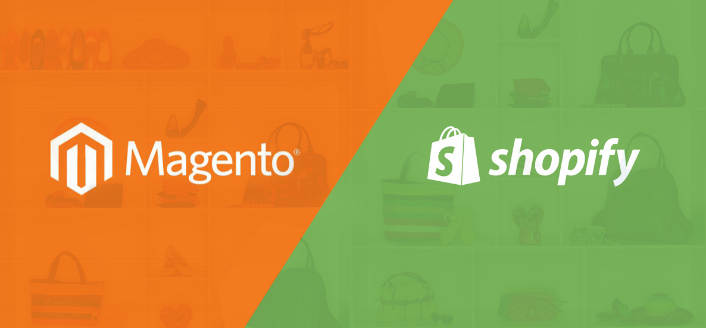

Als je overtuigd bent over de voordelen van een CMS, moet je uiteraard een keuze maken uit de vele opties. We overlopen de meest populaire platformen, zodat je de beste keuze kan maken voor jou.

## WordPress

[Wordpress](https://wordpress.org "WordPress CMS") domineert de markt van CMS al jaren en is zowat de **benchmark** geworden in de wereld van CMS. Het is een erg gebruiksvriendelijk en populair systeem, met **duizenden (zowel gratis als betalende) plugins en thema's**. Je vind ongetwijfeld een thema dat je aanspreekt en de integratie met andere diensten gebeurt meestal erg vlot. In vele gevallen is het platform dan ook de beste keuze. Als je e-commerce wil integreren in je website is het ook goed om weten dat WordPress een erg handige en populaire plugin hiervoor heeft: de WooCommerce-plugin.
Opgelet! Wordpress heeft **2 varianten: wordpress.org en wordpress.com**. De .org-variant is gratis te downloaden. Je koopt dan zelf je domeinnaam en hosting. De .com-variant is meer een all-in-one, betalend pakket waar hosting en domeinnaam inbegrepen zijn. Ken je niets van hosting af raden we je aan de .com-variant te gebruiken. Verder is de kostprijs van beide varianten erg afhankelijk van het thema dat je installeert.

## Drupal

[Drupal](https://www.drupal.org) biedt grotendeels dezelfde functionaliteiten als WordPress maar heeft over het algemeen **meer mogelijkheden om te configureren**. Het geeft je dus wat meer flexibiliteit en is naar schaalbaarheid meestal de ideale keuze. Hierdoor is het vaak meer weggelegd voor de ietwat grotere bedrijven. De configuratie-mogelijkheden komen wel met de kost dat het systeem ingewikkelder is en het dus iets langer kan duren voor je er mee weg bent. Schrikt dit je niet af? Ga dan voor Drupal!

## Joomla

[Joomla](https://www.joomla.org "Joomla CMS") is het **oudste platform** dat we hier bespreken en is lange tijd het populairste CMS geweest. Hoewel het een uitstekend platform is, heeft het doorheen de jaren veel marktaandeel verloren aan de andere CMS. Joomla heeft **minder plugins en extensies** beschikbaar en vele hiervan zijn ondertussen verouderd.
Gerucht gaat de ronde dat Joomla ook minder goed zou zijn voor SEO. Het is waarschijnlijk verstandiger om verder te kijken naar een oplossing die meer "future-proof" is.

## Wix

Een andere populair CMS dat aan een opmars bezig is, is [Wix](https://www.wix.com/ "Wix CMS"). Het is een platform dat kant en klaar met hosting gekocht kan worden. het is een erg intuïtief systeem dat je toelaat om websites te maken aan de hand van een "**drag- en dropsysteem**". Qua gebruiksgemak is dit dus een erg goede keuze.

Let echter op dat de functionaliteiten erg beperkt zijn. Wix biedt ook een gratis versie aan, maar die is echter erg beperkt. In de meeste gevallen zal je moeten upgraden naar een premium plan als je een eigen domeinnaam, plugins en geen advertenties op je website wil.

## Magento, Shopify

Magento en Shopify zijn 2 volledig aparte CMS platformen, maar zijn beiden erg gefocust op **e-commerce**. Ze scoren hoog in populariteit en bieden een uitweg als je niet voldoende hebt aan een plugin van de andere CMS. Ze onderscheiden zich dus door meer functionaliteit voor e-commerce aan te bieden.

Verschil tussen beiden is dat **Magento volledig open-source, en dus gratis** te gebruiken is. **Shopify is een betalend platform**, maar is gebruiksvriendelijker en dus makkelijker om op te zetten. Magento is de meer geavanceerde van de twee, waar Shopify meer entry-level is.

## Onze keuze

Indien je echt nood hebt aan een Content Management Systeem raden we in de meeste gevallen WordPress aan. Het blijft een veelzijdig platform, dat enorm populair is dat voorlopig zeker zal blijven.

Heb je hulp nodig met het opzetten van een WordPress website?
[Vraag dan nu jouw persoonlijke offerte.](/contact "Vraag je offerte aan")
